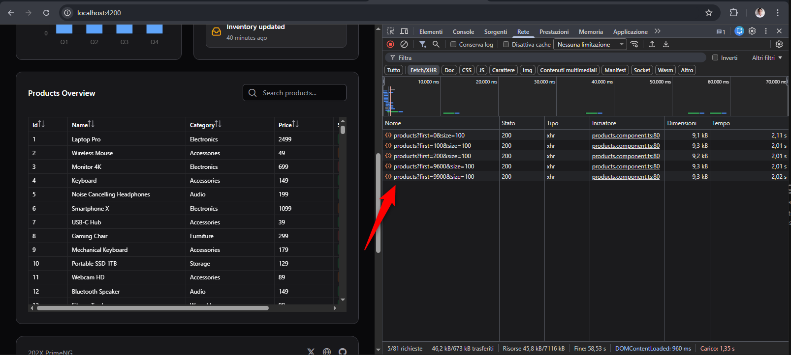
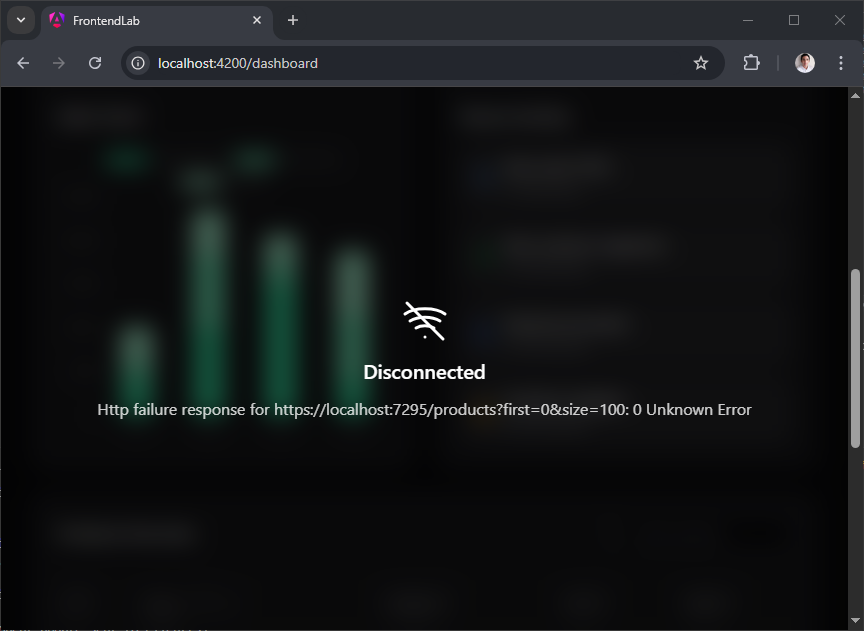
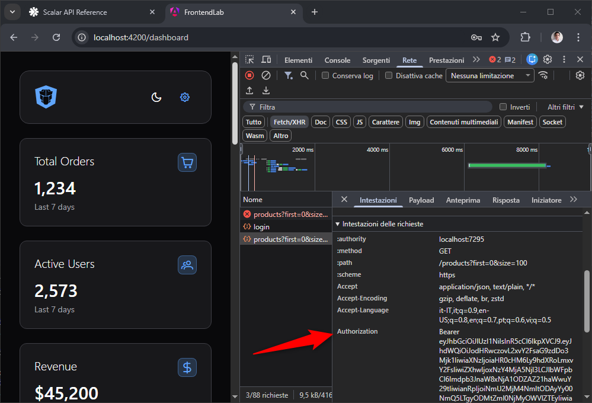
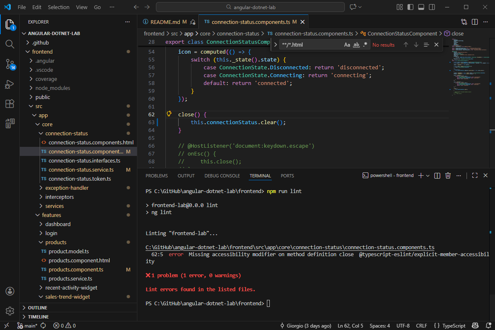

<div align="center">
  <h1>Angular Frontend & ASP.NET Core Web API</h1>
  <em>A modern full-stack architecture for scalable web applications</em>
</div>

<div align="center">
  
</div>

<p align="center">
  <a href="#about">About</a> &nbsp;|&nbsp;
  <a href="#frontend">Frontend</a> &nbsp;|&nbsp;
  <a href="#backend">Backend</a> &nbsp;|&nbsp;
  <a href="#Starting">Starting</a>
</p>

---

### About ###

> This repository provides a modern full-stack architecture for scalable web applications, combining an Angular 21 frontend with Tailwind CSS for styling and PrimeNG for components, tested using Vitest. The backend is built with ASP.NET Core Minimal APIs on .NET 10, following a Vertical Slice Architecture, while API documentation and testing are powered by Scalar. Secure communication between frontend and backend is implemented through JWT (JSON Web Token), ensuring robust authentication and authorization. This approach delivers a clean, modular, and high-performance solution, making it a robust foundation for modern, high-performance web solutions.

---

### Frontend ###
  - [PrimeNG - Angular UI Component Library](https://primeng.org/) The Next-Gen UI Suite for Angular. Enhance your web applications with PrimeNG's comprehensive suite of customizable, feature-rich UI components.

      [Lazy-Loaded Virtual Scrolling](./frontend/src/app/features/products/products.component.ts) 
          
      <em>Virtual scroll is implemented by creating an array that already matches the total number of records and filling it with placeholders. As the user scrolls, only the requested slice of data is loaded from the server and inserted into the correct positions. If that portion is already present, no request is made. This keeps the table lightweight while still showing a full scrollable dataset.
      </em>
      <table align="center">
      <tr>
        <td>
          <a href="./frontend/public/virtual-scroll.png">
            
          </a>
        </td>
      </tr>
    </table>

  - [Vitest | Next Generation testing framework](https://vitest.dev/) – Vitest is the new default testing framework for Angular, designed to be fast, modern, and TypeScript-friendly. It leverages Vite for ultra-fast builds and offers a Jest-like API for familiarity.

<table align="center">
  <tr>
    <td>
      <div align="center">
        <em>Vitest Web UI</em><br/>
      <div>
      <a href="./frontend/public/vitest.png">
        
      </a>
    </td>
    <td>
      <div align="center">
        <em>Vitest console</em><br/>
      <div>
      <a href="./frontend/public/vitest-2.png">
        
      </a>
    </td>
  </tr>
</table>

  - [HttpInterceptor](frontend/src/app/core/interceptors/http.interceptor.service.ts) – Angular service that globally intercepts HTTP requests and responses to modify them (e.g., add headers, change URLs) or handle errors before they reach the app or server.

<table align="center">
  <tr>
    <td>
      <div align="center">
        <em>Disconnected state</em><br/>
      <div>
      <a href="./frontend/public/disconnected-state.png">
        
      </a>
    </td>
    <td>
      <div align="center">
        <em>JWT auth</em><br/>
      <div>
      <a href="./frontend/public/jwt-auth.png">
        
      </a>
    </td>
  </tr>
</table>

  - [Zod](https://zod.dev/) - Zod is a TypeScript-first schema validation library. It   allows you to define schemas for your data and validate objects against those schemas at runtime.
    I used Zod to validate communication between the Backend and Frontend. This means:

    - When the backend sends a response, you validate it against a Zod schema to ensure it matches the expected structure.
    - When sending data to the backend, you validate the payload before making the request.

<table align="center">
  <tr>
    <td>
      <div align="center">
        <em>If validation fails, a toast message is displayed.</em><br/>
      <div>
      <a href="./frontend/src/app/core/exception-handler/exception-handler.service.spec.ts">
        
      </a>
    </td>
  </tr>
</table>


  - [ESLint](https://eslint.org/) - ESLint is used to keep the codebase clean and consistent by automatically detecting errors, enforcing code style, and applying Angular and TypeScript best practices during development.

<table align="center">
  <tr>
    <td>
      <div align="center">
        <em>ESlint validation.</em><br/>
      <div>
      <a href="./frontend/public/eslint.png">
        
      </a>
    </td>
  </tr>
</table>

---
### Backend ###
  - [Scalar](https://scalar.com/) – Scalar is a modern, open-source developer experience platform designed to streamline API documentation and testing, offering an intuitive interface, advanced features, and improved usability compared to traditional tools like Swagger, making it ideal for creating, exploring, and managing APIs efficiently.

<table align="center">
  <tr>
    <td>
      <div align="center">
        <em>Scalar</em><br/>
      <div>
      <a href="./frontend/public/scalar.png">
        
      </a>
    </td>
  </tr>
</table>

---

### Starting ###

#### Frontend ####

```bash
npm i
npm run vitest:ui
npm run lint
npm start
```
---

#### Backend ####

```bash
dotnet build
dotnet run
```
